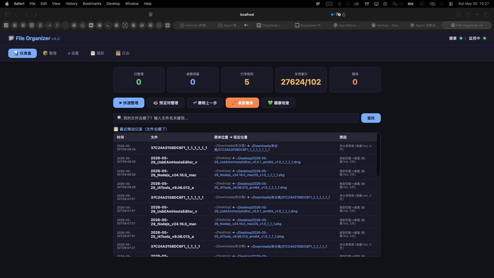

# File Organizer

> 智能文件管家 — 桌面和下载文件夹永远不会乱。零操作，全自动，完全本地。

[](LICENSE)
[](https://python.org)
[]()

<p align="center">
  
</p>

---

## 这是什么

你下载文件、保存截图、接收文档。它们堆积在桌面和下载文件夹里。

**File Organizer** 是一个后台运行的 macOS 智能管家：

- 📥 文件变更后 **60 秒自动整理**，你什么都不用做
- 🧠 读取文件内容 + 全盘学习你的文件夹习惯，**越用越准**
- 🔥 区分热度：常用的留桌面，不常用的归档，**桌面上永远是你的活跃文件**
- ↩️ 每次移动都记录，**随时撤销**，不丢一个文件
- 🔍 内置搜索："我的文件去哪了？" —— 输入关键词就能找到
- 🔒 **100% 本地运行**，不上传任何数据

---

## 快速开始

```bash
# 一行安装
git clone https://github.com/Kmrnn9888/DeskBuddy---.git && cd DeskBuddy--- && bash install.sh
```

安装完成后访问 **http://localhost:8899** 打开控制面板。

---

## 功能矩阵

| 层级 | 功能 | 说明 |
|------|------|------|
| **无感层** | 文件变更 60s 自动整理 | 零操作，只有结果 |
| **通知层** | macOS 原生通知 | 告知每次移动的文件和去向 |
| **预览层** | Web 面板预览 | 想确认时看一眼，再点执行 |
| **纠正层** | 撤销 / 全部撤销 | 一键回退，不留痕迹 |
| **学习层** | 反馈学习 + 文件夹结构提取 | 越用越准，自动适应你的习惯 |
| **自愈层** | 健康自检 + 崩溃自动重启 | 完全不用管运维 |

### 核心亮点

- **jieba 中文分词** — 文件名和内容的精准中文理解
- **内容分析** — 读取 txt / md / json / html 文本内容辅助分类
- **全局文件索引** — 扫描整个 Home 目录，学习 "什么文件通常放在哪里"
- **四档热度分级** — Hot (7天) / Warm (30天) / Cold (90天) / Frozen
- **SHA256 校验** — 移动前后校验文件完整性，失败自动回滚
- **文件夹级分派** — 自动识别项目文件夹并整体搬迁到合适位置
- **深度惩罚** — 避免把普通文件误放到过深的子目录
- **残留检测** — 发现并合并部分移动后留下的目录碎片

---

## 分类逻辑

```
输入文件
  │
  ├─ 1. 规则匹配 (优先级最高)
  │    内置规则: 建筑学/英语/心理学/财务/软件/...
  │    自定义规则: 用户添加的关键词→路径映射
  │    反馈学习: 从用户手动归类中学习的权重
  │
  ├─ 2. 全局索引预测
  │    扫描全盘文件分布 → TF-IDF 匹配最佳目录
  │    深度 >3 层 + 低置信度 → 自动回退
  │
  ├─ 3. 内容分析
  │    读取文本文件内容 → 提取关键词 → 规则匹配
  │
  └─ 4. 扩展名默认
       .pdf → Documents / .jpg → Pictures / .dmg → Software
       未识别 → 未分类
  │
  └─ 热度微调
       Hot + 安装包 → Software (不留桌面)
       Frozen → Archive
```

---

## 项目结构

```
file-organizer/
├── src/
│   ├── engine.py       # 核心引擎（分类/索引/事务/撤销/自愈）
│   ├── app_web.py      # Web 控制面板（Flask-free, 纯 stdlib）
│   └── launcher.py     # macOS 菜单栏应用
├── install.sh           # 一键安装脚本
├── docs/
│   └── architecture.md  # 架构设计文档
├── screenshots/
│   └── dashboard.png    # 控制面板截图
├── LICENSE
└── README.md
```

---

## 系统要求

- macOS 12+
- Python 3.9+ (系统自带)
- 依赖: `jieba` (自动安装)
- 无需网络连接，完全离线

---

## 管理命令

```bash
# 查看日志
tail -f ~/.local/log/fo-stdout.log

# 停止服务
launchctl unload ~/Library/LaunchAgents/com.fileorganizer.web.plist
launchctl unload ~/Library/LaunchAgents/com.fileorganizer.watch.plist

# 重启服务
launchctl load ~/Library/LaunchAgents/com.fileorganizer.watch.plist
launchctl load ~/Library/LaunchAgents/com.fileorganizer.web.plist

# 手动触发整理
python3 ~/.file-organizer/src/engine.py
```

---

## 安全承诺

- ✅ **不删除文件** — 只移动和重命名
- ✅ **不覆盖文件** — 同名自动递增版本号
- ✅ **不上传数据** — 100% 本地运行
- ✅ **事务性移动** — SHA256 校验，失败自动回滚
- ✅ **完整撤销** — 每次移动都可撤回

---

## 从已有文件夹学习

如果你的某个文件夹组织得很好（比如 `Kamran/` 下有 `博物馆/`、`Assignment/` 等子目录），系统可以自动学习：

```
控制面板 → 规则 → 学习文件夹 → 输入路径
```

系统会提取每个子目录的关键词，注册为自动分类规则。

---

## License

MIT — 随意使用、修改、分发。
